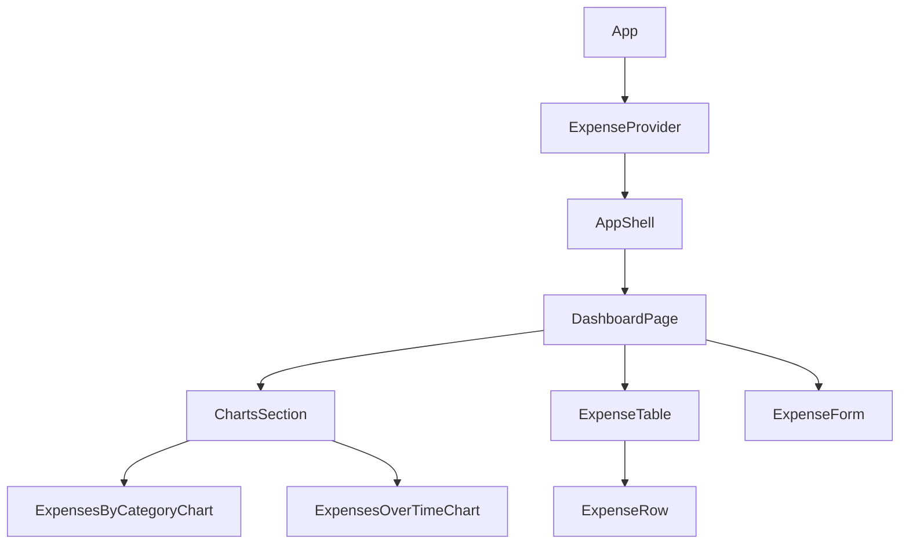
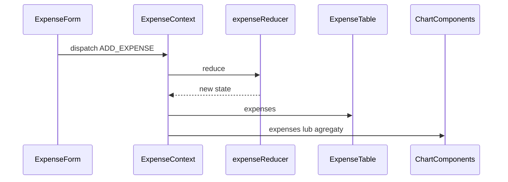

# Plan: Dashboard wydatków w React

## Zakres funkcjonalny

- **Wykresy** — np. sumy po kategoriach (wykres kołowy), trendy w czasie (liniowy/słupkowy), opcjonalnie porównanie miesięcy.
- **Tabela** — lista transakcji z sortowaniem/filtrowaniem (data, kategoria, kwota).
- **Formularz** — dodawanie wydatku: kwota, data, kategoria, opis/notatka; walidacja po stronie klienta.

## Stack techniczny (rekomendacja)

| Obszar | Wybór |
|--------|--------|
| Bundler / szablon | Vite + React + TypeScript |
| Wykresy | [Chart.js](https://www.chartjs.org/) + [react-chartjs-2](https://react-chartjs-2.js.org/) (rejestracja `ChartJS.register(...)` raz w module wykresów) |
| Styling | CSS Modules lub istniejący design system w projekcie; na start wystarczy spójny layout (np. CSS Grid / flex) |

## Struktura folderów (wysoki poziom)

```
src/
  main.tsx
  App.tsx
  types/           # Expense, Category, itd.
  data/            # domyślne kategorie, stałe
  context/         # ExpenseProvider, hook useExpenses
  hooks/           # np. useLocalStorageSync (opcjonalnie)
  components/
    layout/        # AppShell, PageHeader
    expenses/      # ExpenseTable, ExpenseForm, ExpenseRow
    charts/        # ExpensesByCategoryChart, ExpensesOverTimeChart
  utils/           # agregacje pod wykresy, formatowanie waluty/dat
```

## Hierarchia komponentów



- **`AppShell`** — nawigacja (jeśli później więcej widoków), kontener max-width, nagłówek.
- **`DashboardPage`** (lub `App.tsx` na początku) — układ sekcji: wykresy u góry, tabela + formularz poniżej (lub formularz w panelu bocznym / modalu — decyzja UX).
- **`ChartsSection`** — siatka kart z wykresami; każdy wykres w osobnym komponencie, żeby łatwo podmieniać typ wykresu.
- **`ExpenseTable`** — nagłówki, mapowanie wierszy; stan sortu/filtrów lokalnie lub w kontekście, jeśli ma być współdzielony.
- **`ExpenseForm`** — kontrolowane pola, `onSubmit` wywołuje akcję z kontekstu (`addExpense`).
- **Komponenty wykresów** — tylko prezentacja: przyjmują **już zagregowane** dane (tablica etykiet + wartości) z `utils`, nie liczą logiki biznesowej w środku.

## Przechowywanie danych — rekomendacja

### Stan aplikacji (lista wydatków)

**Rekomendacja: `React Context` + `useReducer`**, a nie sam `useState` w Context, bo:

- Masz wyraźne **akcje** (`ADD_EXPENSE`, `DELETE_EXPENSE`, `UPDATE_EXPENSE`, ewentualnie `LOAD_FROM_STORAGE`).
- Reducer ułatwia **przewidywalne** aktualizacje i testowanie logiki bez UI.
- Unikasz częstego problemu „nowa funkcja w `value` przy każdym renderze” — **memoizacja** `dispatch` z `useReducer` + stabilny `value` (np. `useMemo` dla obiektu `{ state, dispatch }` tylko jeśli potrzebne) utrzymuje sensowną wydajność przy średniej liczbie wierszy.

**Kiedy rozważyć coś innego:**

- **Zustand / Jotai** — mniej boilerplate, dobre gdy stan rośnie lub potrzebujesz selektorów bez przepinania Providerów.
- **TanStack Query** — gdy dane idą z API; wtedy „źródłem prawdy” jest serwer, a Context tylko dla UI (filtry, motyw).

Dla typowego dashboardu **lokalnego** (bez backendu na start) **Context + reducer wystarczy** i dobrze odpowiada na Twoje pytanie.

### Persystencja (ważne uzupełnienie)

Context **nie zapisuje** danych po odświeżeniu strony. Plan:

1. **Faza 1:** stan tylko w pamięci (najszybszy start).
2. **Faza 2:** synchronizacja z **`localStorage`** (hook lub efekt w Providerze: przy starcie `LOAD`, przy zmianie `SAVE`) — wystarczy na jednego użytkownika w przeglądarce.
3. **Później:** REST/GraphQL + baza — Provider staje się cienką warstwą nad API.

## Przepływ danych (uproszczony)



- **Agregacje pod wykresy** — funkcje w `utils/` (np. `groupByCategory`, `sumByMonth`), wywoływane w komponencie nadrzędnym lub przez `useMemo` zależne od `expenses`, żeby nie przeliczać bez potrzeby.

## Typy danych (model)

Minimalny model `Expense`:

- `id` (np. `crypto.randomUUID()`),
- `amount` (number),
- `currency` (opcjonalnie, stała na start),
- `date` (ISO string lub `Date` konsekwentnie w jednym miejscu),
- `categoryId` lub string,
- `note` (opcjonalnie).

Kategorie jako tablica stałych lub osobny słownik — ułatwia spójność w formularzu i kolorach wykresów.

## Kolejność implementacji (po akceptacji planu)

1. Inicjalizacja projektu (Vite + TS), podstawowy layout.
2. Typy + `expenseReducer` + `ExpenseProvider` + `useExpenses`.
3. `ExpenseForm` podpięty do `dispatch`.
4. `ExpenseTable` z listą i podstawowymi akcjami (usuń / edycja opcjonalnie).
5. Rejestracja Chart.js + pierwszy wykres (np. kategorie), potem drugi (czas).
6. Opcjonalnie: `localStorage` + wczytanie przy starcie.

## Ryzyka / decyzje do przemyślenia

- **Waluta i formatowanie** — `Intl.NumberFormat` dla spójnego PLN.
- **Strefa czasowa dat** — trzymać datę jako `YYYY-MM-DD` + interpretacja „lokalnego dnia” albo zawsze UTC; jedna konwencja w całej aplikacji.
- **Dostępność** — formularz z etykietami, tabela z semantycznym `<table>`.

---

Podsumowanie: **struktura oparta o `components/` (layout, expenses, charts) + `context` z reducerem**; wykresy przez **react-chartjs-2** z danymi z **utils agregujących** listę wydatków; na start Context w pamięci, z jasną ścieżką do **localStorage** lub API.
